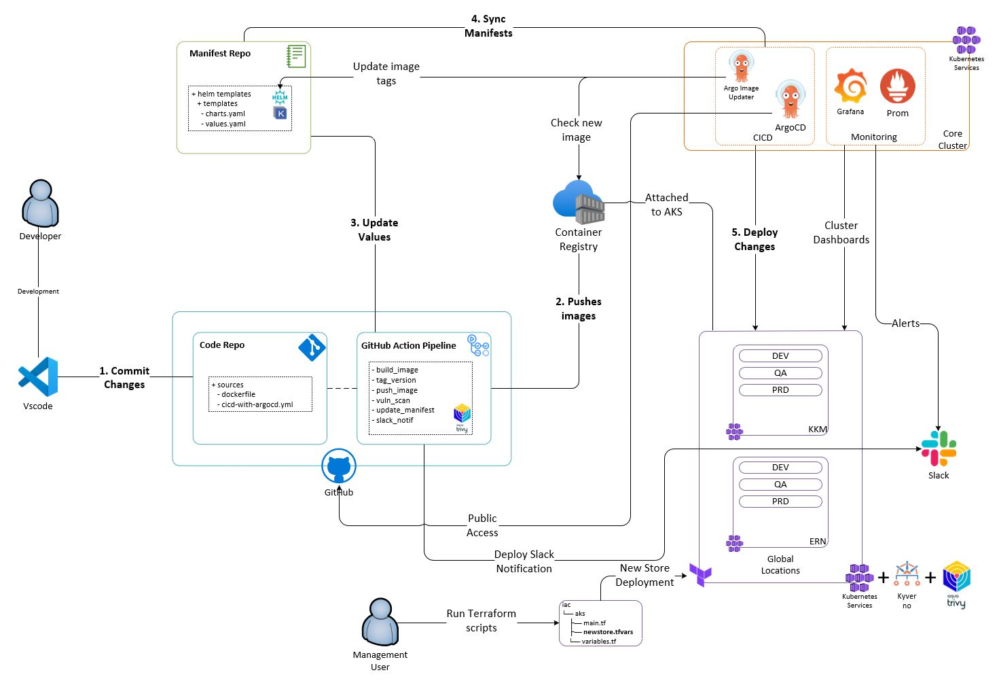

# Welcome to the **POS System DevOps** Repository
Here, you'll find useful information and documentation related to the development and usage of this project.

## Table of Contents

- [Overview](#overview)
- [Infrastructure](#documentation)
  - [IaC Deployment](docs/iac.md)
  - [Installation Guide](docs/installation-guide.md)  
  - [User GitOps Manual](docs/gitops-deployment.md)
- [Application](#documentation)
  - [POS System Application Managament](docs/pos-mgmt.md)
  - [Environment Monitoring](docs/monitoring.md)
  - [Security Compliance](docs/security.md)
  - [Scalability](docs/scalability.md)  

---

## Overview
This project we have establish a structured approach for managing infrastructure by creating dedicated Git repositories to store configurations and deployment templates. 

To streamline the deployment of POS software updates, set up CI/CD pipelines using modern GitOps tools like ArgoCD. 

These pipelines are automated deployments across distinct environments—Development, Testing, and Production—enabling efficient testing, validation, and rollouts while reducing manual intervention.

