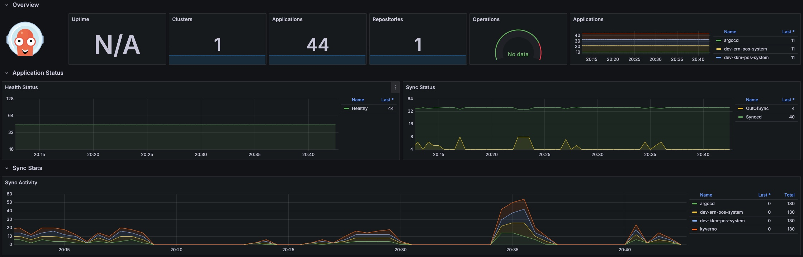
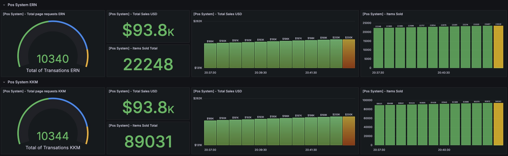

# Monitoring
Centralize logs and metrics for all store locations in a dashboard.

```plaintext
├── monitoring
│   └── kube-prometheus-stack
│       ├── charts
│       │   ├── crds
│       │   │   └── crds
│       │   ├── grafana
│       │   │   ├── ci
│       │   │   ├── dashboards
│       │   │   └── templates
│       │   │       └── tests
│       │   ├── kube-state-metrics
│       │   │   └── templates
│       │   ├── prometheus-node-exporter
│       │   │   ├── ci
│       │   │   └── templates
│       │   └── prometheus-windows-exporter
│       │       └── templates
│       └── templates
│           ├── alertmanager
│           ├── exporters
│           │   ├── core-dns
│           │   ├── kube-api-server
│           │   ├── kube-controller-manager
│           │   ├── kube-dns
│           │   ├── kube-etcd
│           │   ├── kube-proxy
│           │   ├── kube-scheduler
│           │   └── kubelet
│           ├── grafana
│           │   └── dashboards-1.14
│           ├── prometheus
│           │   └── rules-1.14
│           ├── prometheus-operator
│           │   └── admission-webhooks
│           │       ├── deployment
│           │       └── job-patch
│           └── thanos-ruler
```

## Monitoring Dashboards
Structure for customized dashboard for infrastructure and application layers

```plaintext
├── grafana
│   └── dashboards-1.14
├── prometheus
│   └── rules-1.14


Important dashboard files create for the use case

├── argocd.yaml
├── kyverno.yaml
├── trivy.yaml
├── pos-system.yaml
```

ArgoCD as a core component of the application deployment pipeline, enabling faster, automated, and consistent deployments while improving visibility, traceability, and operational efficiency.


Kyverno as the policy management solution for Kubernetes to ensure compliance, enforce standards, automate security practices, and streamline cluster governance.


Trivy is a comprehensive, easy-to-use security scanner that helps identify vulnerabilities, misconfigurations, and exposed secrets across various assets.


Design and implement a centralized dashboard for the POS system that collects, analyzes, and visualizes key metrics from the application side.