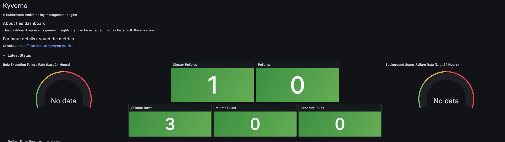
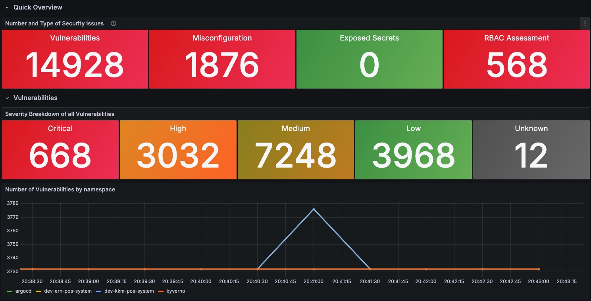
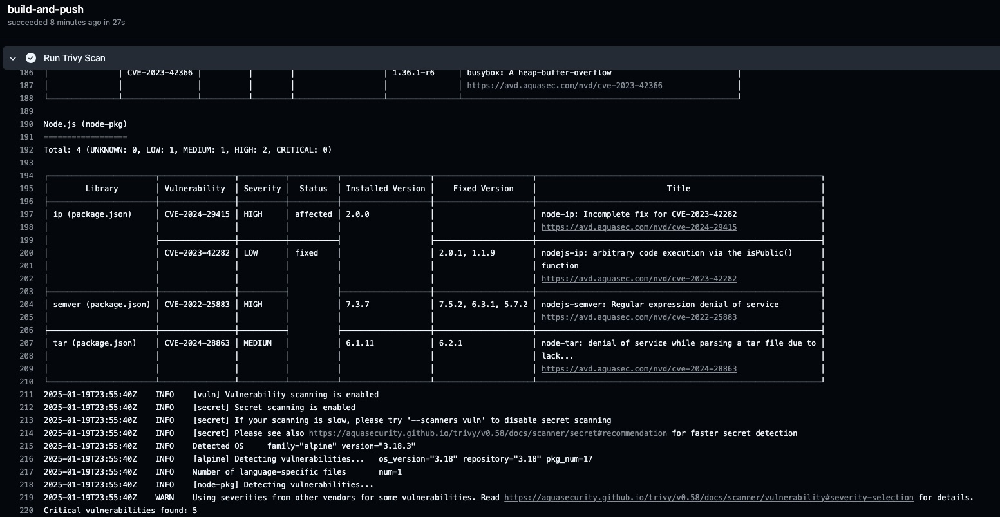
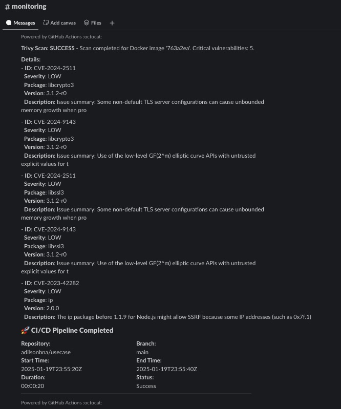

# Security and Compliance
Implement validation checks for all deployments to ensure compliance with PCI DSS.

Kyverno and Trivy are among the most robust tools for ensuring security and compliance. Both offer extensive customization options for vulnerability scanning and are seamlessly integrated into the CI/CD pipeline, delivering real-time notifications to Slack for prompt alerting and action.

## Dashboards

#

#

#

